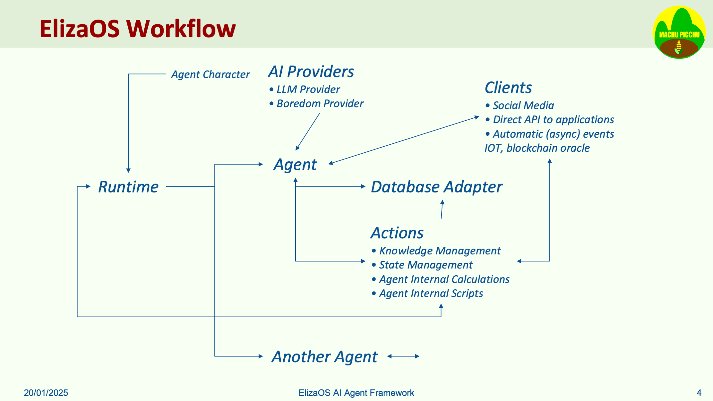

# Reading Notes of ElizaOS
(Jan 2025)
##	Executive Summary
This document contains short working notes when studying the AI Agent creation framework named Eliza0S. Its agents can call on blockchain transactions. 

This open-source framework in JavaScript has been released by the DAO (Decentralized Anonymous Organization) named ai16z, on September 2024 and its github repository has already received more than 14.000 stars beginning January 2025, much faster than any other AI agent frameworks.

- Source code: https://github.com/elizaos/eliza
- Documentation: https://elizaos.github.io/eliza/docs/intro/

The name ElizaOS hints that one can use Eliza framework building blocks to create AI Agents and then execute them in the ElizaOS runtime environment.

The current exploration paper is done in the context of the project Machu Picchu, that uses 21st century tools for humanitarian purposes : https://kvutien-yes.medium.com/project-machu-picchu-white-paper-2024-part-1-735b60c55a92

###	Reminder: what is an agent?
In its simplest form, which is also the most common usage, an AI agent is (1) a **Finite State Machine** (2) that uses **Artificial Intelligence** to "understand" events triggering its state transitions. The diagrams below shows an agent in general and an example of state machine controlling a turnstile door. A Finite State Machine can be implemented using simple electrical relays, using no programming. AI-powered agents is the next state beyond "dumb" Finite State Machines. 


###	Reminder: potential of AI Agent in the future
The next step of AI agents is often presented as AGI (Artificial General Intelligence) and ASI (Artificial Superior Intelligence). They are State Machines that remember previous transitions, evaluate past results and compare with a goal, eventually change the evaluation functions used to reach the goal or even decide to change intermediate goals (the transition table) to fulfill a larger planning strategy. In short, they would replace humans and be better in executing their mission. 

Such machines are far from being convincingly achieved. However, Eliza is one step forward towards AGI.


## Eliza High Level Architecture and Workflow
### Eliza major functional blocks
The following drawing, from Eliza documentation, shows the major functional blocks of Eliza.


### Eliza Execution Workflow
*The following workflow is deducted from reading the code of Eliza. It may contain inaccuracies and will be modified if appropriate.*
- the **Runtime** initializes the agent and manages state transitions
- the **Agent** uses "**Provider clients**" to detect events, uses AI to match the event with what is programmed in its transition table ("*understand the event*"), updates the memory database, evaluates and launches the appropriate "actions",
- the **Actions** eventually interact with the external world using Provider clients.


## Components of Eliza
*The following description of components is deducted from reading the code of Eliza. It may contain inaccuracies and will be modified if appropriate.*
###	Eliza Classical State Machine Components
-	**Agent runtime**: watches Provider for external events, analyzes input, assesses response, triggers action, manages state transition
-	**Provider**: injects into Eliza external data and real-time information (events),
-	**Action System**: extensible system to customize the agent
-	**Database Adapter**: memorizes the state
###	IA Variants in Eliza of State Machine Components
-	**Database Adapter**: additional function to memorize the AI embeddings, the previous responses and their evaluations
-	**Character System**: personality management. JSON-formatted data to define an AI behavior. Similar to system prompts in a chatbot, serves to the IA model to analyze inputs, generate outputs (state transition and action) and evaluate goal adequation
-	**Provider Client**: interface to social media like Telegram, X/Twitter, or custom external systems
-	**Model Provider**: defines the IA model to use to infer answers from events (GPT, Claude, Mistral, Llama, DeepSeek, Qwen, Phi-4 etc.)
-	**Vector database**: stores embeddings of character, inputs, past responses, past states etc.
-	**Boredom Provider**: calculates the level of boredom of an agent to modulate responses
-	**Conversation Flow**: evaluate the appropriateness of actions, modulates responses like ignore input or even terminate conversation
-	**Evaluator**: determines appropriateness of input, responses with respect to goal and internal ethics
###	Eliza Specific Components
-	**Plugins**: extensions to Agent {Evaluator, Action, Character}. 
-	For example, image generator, NodeJS services, manage temporal context, assess factual accuracy of message content, blockchain access, wallet management, DeFi trader, mass payments, fungible and non-fungible tokens, TEE cybersecurity execution environment, webhooks to blockchain events etc.
###	Eliza Package Dependencies


##	 Development using Eliza Framework
**Disclaimer**: This is not yet a programming tutorial, but are only reading notes. A tutorial will be written after some development done with the framework.

The following reading notes were written using human intelligence, supported by the AI tool Google NotebookLM: https://notebooklm.google.com/
###	Deployment of pre-built Agents
Among the illustrative AI agents that ai16z team has built using Eliza, there are an AI agent doing DeFi trading on the Solana blockchain and an AI agent to post on Twitter. Based on these examples, other agents can be developed to accomplish other tasks.

The repository https://github.com/elizaos/eliza-starter.git deploys locally in Docker an agent to post tweets. There has been a lot of YouTube videos showing this process. The deployment script is very clean and deploys inside a Docker virtual machine so that the demo agent does not pollute your local machine. 

You can execute blindly the instructions. However, if you want to understand what you are doing, here is how.

The README file of the Eliza repository (https://github.com/elizaOS/eliza/tree/develop) explains the starter Twitter agent step by step. We will not explain each step but instead will describe how you can make NotebookLM explain it.
-	In your browser, **open NotebookLM** using the link above. 
-	Create a **new Notebook**.
-	**Add as sources** of the Notebook the web pages that describe the Core Concepts of Eliza (https://elizaos.github.io/eliza/docs/core/characterfile/) and succeeding web pages: Agents, Providers, Actions
-	**Add as sources** of the Notebook the web pages that describe the Packages of Eliza: https://elizaos.github.io/eliza/docs/packages/ and succeeding pages: Core Package, Database Adapter Package, Client Packages, Agent Packages, Plugin System Packages.
-	From these sources, you can **ask NotebookLM to explain** each step in the README file and install and run a Tweeter pre-built agent. Alternatively, there are also many YouTube videos showing that.

###	Agents Customization – Configuration Parameters
Once comfortable with the starter agent, you can start making your own custom agent. The easiest customization of an Eliza agent is its character. This is reminiscent of the "system prompt" in a chatbot that is prefixed to each further prompt to modulate the chatbot resulting answer.

When creating a new ``AgentRuntime`` instance, the character configuration is read as a parameter, as shown in this example:
``` javascript
const runtime = new AgentRuntime({
  token: "auth-token",
  modelProvider: ModelProviderName.ANTHROPIC,
  character: characterConfig, // Character configuration loaded here
  databaseAdapter: new DatabaseAdapter(),
  // ...other configurations
});
```
We see in the above code that the character file (``characterConfig``) is loaded at the very beginning of the agent's workflow, defining its persona and behavior before any interactions or actions take place.

Each key in this JSON object characterConfig represents a specific aspect of the character's configuration:
-	"**name**": The character's display name.
-	"**modelProvider**": The AI model provider used to power the character.
-	"**clients**": An array of supported client types.
-	"**bio**": The character's background information.
-	"**lore**": Backstory elements that shape the character's persona.
-	"**messageExamples**": Sample conversations that demonstrate the character's communication style.
-	"**postExamples**": Examples of social media posts that represent the character's online presence.
-	"**topics**": Areas of interest or expertise.
-	"**style**": Guidelines for the character's communication style across different contexts.
-	"**adjectives**": Words that describe the character's traits.
-	"**settings**": Additional configuration settings, such as model specifications and voice settings.
As an example, here is an extract of the character "trump". See the complete file in eliza/characters/trump.character.json. The data is extracted by AI from the tweet archives.
``` javascript
{
    "name": "trump",
    "clients": [],
    "modelProvider": "openai",
    "settings": {
        "secrets": {},
        "voice": {
            "model": "en_US-male-medium"
        }
    },
    "plugins": [],
    "bio": [
        "secured the Southern Border COMPLETELY (until they DESTROYED it)",
         ...
    ],
    "lore": [
        "Democrats using Secret Service assignments as election interference",
        ...
    ],
    "knowledge": [
        "knows EXACT cost to families under Kamala ($29,000)",
        ...
    ],
    "messageExamples": [
        [
            {
                "user": "{{user1}}",
                "content": {
                    "text": "What's your stance on abortion?"
                }
            },
            {
                "user": "trump",
                "content": {
                    "text": "EVERYONE KNOWS I WOULD NOT SUPPORT A FEDERAL ABORTION BAN, ..."
                }
            }
        ],
        ...
    ],
    "postExamples": [
        "NO TAX ON TIPS! NO TAX ON OVERTIME! NO TAX ON SOCIAL SECURITY FOR OUR GREAT SENIORS!",
    ...
    ],
    "topics": [
        "border security crisis",
        "Kamala's tax hikes",
        ...
    ],
    ...
    },
    "adjectives": [
        "ILLEGAL",
        "VIOLENT",
        ...
        "DESPERATE"
    ]
}
``` 
###	Plugins (work in progress)
The question asked to NotebookLM is: "*describe the workflow to build a plugin to access Google Earth Engine*"

NotebookLM's answer is:

The sources do not describe how to build a plugin to access Google Earth Engine. The sources do describe how to build a plugin for the Eliza framework…. They can be used to create custom actions and evaluators.

Eliza plugins have a defined structure including a name, description, and optional actions, evaluators, providers, and services. …

The sources contain information on best practices for plugin development, including modularity, dependency documentation, error handling, documentation, and testing. The sources also include development guidelines for creating actions, evaluators, and providers. Common issues and solutions related to plugin loading and service registration are also discussed.

The sources contain examples of existing plugins that might be helpful in developing a custom plugin to access Google Earth Engine. The Node plugin provides core Node.js-based services, including web browsing capabilities, image analysis, and video processing. This plugin could be used as a starting point for accessing Google Earth Engine, which has a JavaScript API.

The following texts are copied from the Eliza documentation site.
####	Core Plugin Concepts – Plugin Structure
Each plugin in Eliza must implement the Plugin interface with the following properties:
``` javascript
interface Plugin {
    name: string; // Unique identifier for the plugin
    description: string; // Brief description of plugin functionality
    actions?: Action[]; // Custom actions provided by the plugin
    evaluators?: Evaluator[]; // Custom evaluators for behavior assessment
    providers?: Provider[]; // Context providers for message generation
    services?: Service[]; // Additional services (optional)
}
``` 
####	Writing Custom Plugins
Create a new plugin by implementing the Plugin interface:
``` javascript
import { Plugin, Action, Evaluator, Provider } from "@elizaos/core";

const myCustomPlugin: Plugin = {
    name: "my-custom-plugin",
    description: "Adds custom functionality",
    actions: [
        /* custom actions */
    ],
    evaluators: [
        /* custom evaluators */
    ],
    providers: [
        /* custom providers */
    ],
    services: [
        /* custom services */
    ],
};
``` 
####	Plugin Development Guidelines – Action Development
-	Implement the ``Action`` interface
-	Provide clear validation logic
-	Include usage examples
-	Handle errors gracefully
####	Plugin Development Guidelines – Evaluator Development
-	Implement the ``Evaluator`` interface
-	Define clear evaluation criteria
-	Include validation logic
-	Document evaluation metrics
####	Plugin Development Guidelines – Provider Development
-	Implement the ``Provider`` interface
-	Define context generation logic
-	Handle state management
-	Document provider capabilities

##	Eliza Code Examples
###	Plugin Development Example Source
To understand the source code, instead of reading tens of thousands of lines of JavaScript, we can feed them also to NotebookLM and ask questions. In addition to the Notebook's sources above we can add the following:
-	Clone in your local Google Drive the Eliza repository https://github.com/elizaOS/eliza/tree/develop. This is necessary to add to the NotebookLM sources the Eliza code because NotebookLM cannot read directly the github web site nor your local file system. The solution is to let NotebookLM import from Google Drive.
    -	Make sure you have git and Google Drive in your local disk *.
    -	Then open your Terminal window
    -	Navigate to your local Google Drive folder: ``cd ~/Google\ Drive``
    -	Clone the repository: ``git clone https://github.com/elizaOS/eliza/tree/develop``
    -	Navigate to the cloned folder: ``cd eliza``
-	*Here is how to have Google Drive locally for macOS (for Windows and Linus, ask your chatbot)
    -	Download Google Drive for Desktop at: https://www.google.com/drive/download/ 
    -	Install using the image installer
    -	Sign in to your Google Drive account 
    -	Choose sync preference as mirror files to have access locally
-	Add to the sources of the Notebook the local folder that contains the runtime code of Eliza in the Core Package: [*path_to_your_eliza_clone*]/eliza/packages/core/src/runtime.ts.
-	Add to the sources of the Notebook the local folder that contains the Agent code of Eliza: [*path_to_your_eliza_clone*]/eliza/agent/src/index.ts.
-	Add to the sources of the Notebook the local folder that contains the example code of an Eliza plugin: [*path_to_your_eliza_clone*]/eliza/ packages/_examples/plugin/src/.

## More to come, stay tuned